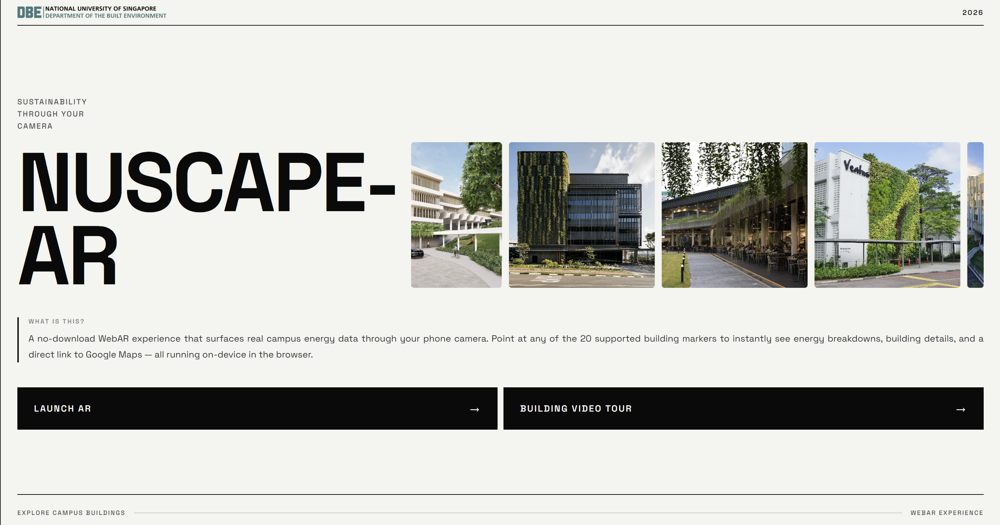
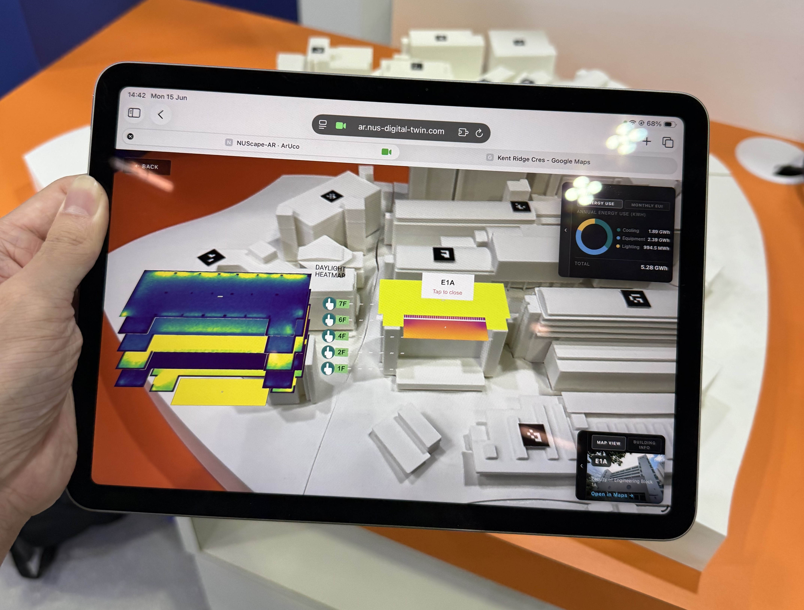

# NUScape-AR

**WebAR for NUS Campus Energy Data**

A no-download WebAR experience that surfaces real campus energy data through your phone camera. Point at any of the 20 supported building markers to instantly see energy breakdowns, building details, and a direct link to Google Maps — all running on-device in the browser.

🔗 **[Launch the experience →](https://ar.nus-digital-twin.com/)**

---

---

## Features

- **Barcode marker tracking** — AR.js detects printed 4×4 BCH barcode markers and anchors A-Frame overlays onto them
- **Energy chart** — doughnut panel showing annual energy breakdown (Cooling / Equipment / Lighting) and monthly EUI (Energy Use Intensity — energy consumption divided by floor area, in kWh/m²) (Energy Use Intensity — energy consumption per unit floor area, measured in kWh/m²)
- **Daylight heatmap** — per-floor daylight simulation images with floor selector
- **Solar heatmap** — rooftop heat distribution overlay showing thermal conditions across the building roof
- **Building showcase** — live demonstrations of each building's sustainability components and green features
- **Maps panel** — building photo card linking to Google Maps

---

## Supported Buildings (20)

| Code | Building |
|------|----------|
| CELC | Centre for English Language Communication |
| E1 | Engineering Block E1 |
| E1A | Engineering Block E1A |
| E2 | Engineering Block E2 |
| E2A | Engineering Block E2A |
| E3 | Engineering Block E3 |
| E3A | Engineering Block E3A |
| E4 | Engineering Block E4 |
| E4A | Engineering Block E4A |
| E5 | Engineering Block E5 |
| E6 | Engineering Block E6 |
| E7 | Engineering Block E7 |
| E8 | Engineering Block E8 |
| EA | Engineering Auditorium |
| EW1 | Engineering Workshop 1 |
| IT | I³ Building |
| SDE1 | School of Design and Environment 1 |
| SDE2 | School of Design and Environment 2 |
| SDE3 | School of Design and Environment 3 |
| SDE4 | School of Design and Environment 4 (net-zero) |
| T-Lab | The Teaching Lab |

---

## Tech Stack

| Library | Role |
|---------|------|
| [AR.js 3.4.8](https://ar-js-org.github.io/AR.js-Docs/) | Handles real-time camera access, marker detection, and pose estimation — it figures out where the physical marker is in 3D space and keeps the virtual content locked to it as the camera moves |
| [A-Frame 1.7.0](https://aframe.io) | Declarative 3D/WebXR framework built on Three.js — renders all the AR overlays (charts, labels, heatmap images, floor buttons) as entities in a scene that AR.js drives |
| [React](https://react.dev) | Builds the landing page and building showcase UI as reusable components with reactive state |
| [Vite](https://vitejs.dev) | Development server and build tool — bundles and serves the React frontend with fast hot-module reload during development |

---

## Markers

The 4×4 BCH barcode markers used for tracking are based on the **ArUco** marker system, developed by Rafael Muñoz-Salinas at the University of Córdoba. AR.js integrates the ArUco detection pipeline for fast, robust marker tracking directly in the browser.

---

*Built for NUS Department of the Built Environment · 2026*
